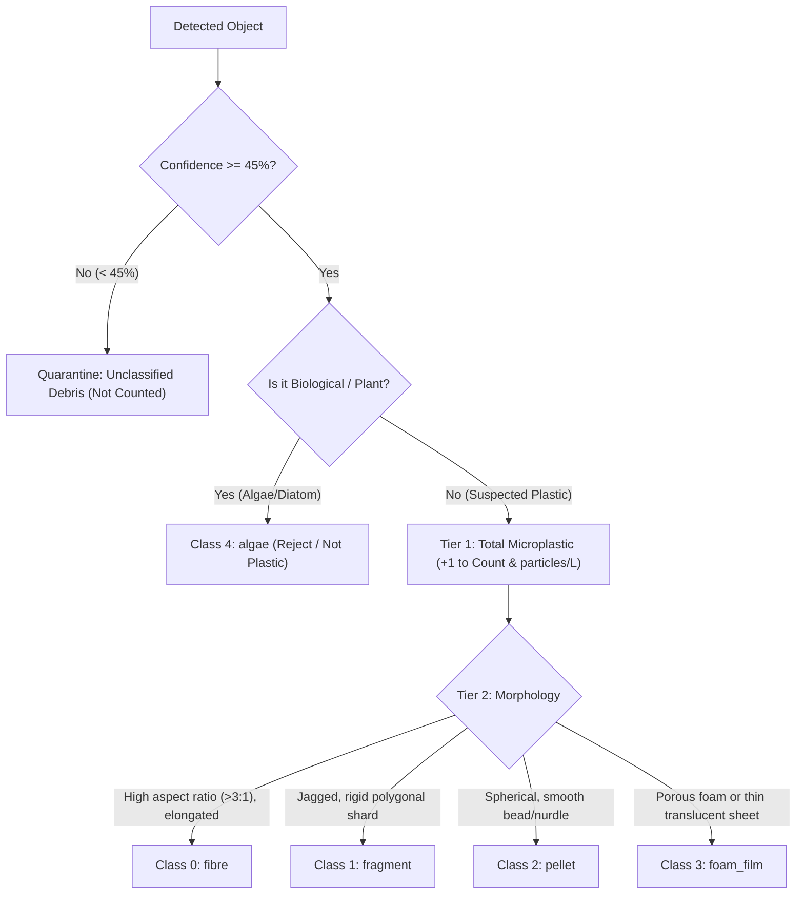

# Microplastic Detector — ML & Dataset Pipeline Plan

A complete, actionable specification for building the **Instance Segmentation (YOLOv8-Seg / YOLO11-Seg)** vision pipeline, gridded filter paper dataset generation with optical domain adaptation, particle sizing engine, multi-model benchmarking, and resolution safeguards.

> [!NOTE]
> **Scope & Phase Notice**:
> - **Modality**: Gridded membrane filter papers (e.g., 0.45 $\mu m$ / 1.2 $\mu m$ membrane with printed 3.10 mm grid lines).
> - **Phase 1 (Active)**: Dataset synthesis on `CLASE_0` gridded paper backgrounds, multi-model training/benchmarking, two-tier classification, $\mu m$ sizing, volume concentration math, and dashboard integration.
> - **Phase 2 (Deferred)**: Hardware pH & TDS sensor integration.

---

## 1. Core Decisions & Specifications

| Decision / Specification | Implementation Strategy |
|---|---|
| **Model Type** | **Instance Segmentation (YOLOv8-Seg / YOLO11-Seg)** (predicts bounding box + polygon mask) |
| **Model Bake-Off** | Benchmark `yolov8n-seg`, `yolo11n-seg`, and `yolo11s-seg` to find the best thin-fibre recall vs latency |
| **Output Hierarchy** | **Two-Tier**: Tier 1 = Total Suspected Plastic vs Rejects; Tier 2 = Specific Morphotypes + Sizing |
| **Unknown Particles** | Confidence gate (< 45%) routes ambiguous particles to **"Unclassified Debris"** (excluded from count) |
| **Sample Modality** | Gridded Membrane Filter Paper (stationary 2D plane, printed grid lines, trapped sediment/silt) |
| **Sizing Metrics** | Length ($\mu m$), Width ($\mu m$), Surface Area ($\mu m^2$), Aspect Ratio via minimum area bounding box |
| **Artifact Rejection** | Dual-Gate: Laplacian edge gradient sharpness filter + UI confidence threshold slider |
| **Optical Floor Guard** | Auto-resolution guard: flags particles < 3 pixels (< $3 \times \mu m/\text{px}$) as near diffraction limit |
| **Hardware** | NVIDIA GeForce RTX 4060 Laptop GPU (8GB VRAM) with PyTorch CUDA; CPU fallback |

---

## 2. Two-Tier Taxonomy & Classification Logic

### 2.1 Non-Target Matter & Edge Cases
- **Sand, Clay & Mineral Silt**: Trained as background via `CLASE_0` silt-covered membrane frames.
- **Natural Fibres (Cotton, Wool)**: Reported under standard optical rules as *"Suspected Microplastic Fibres"*.
- **Rust & Metal Flecks**: Irregular dark spots with atypical textures fall below confidence threshold and get routed to **"Unclassified Debris"**.

---

## 3. Dataset Preprocessing, Mask Extraction & Synthesis Pipeline

### 3.1 Raw Dataset Mapping
- **`data/raw/26511253/MICRO/MICRO/`**:
  - `line/` (660 crops) -> Class `fibre`
  - `hard/` (3,488 crops) -> Class `fragment`
  - `pellet/` (470 crops) -> Class `pellet`
  - `foam/` (181 crops) -> Class `foam_film`
  - `noise/` (311 crops) -> Negative background samples
- **`data/raw/Microplastics and algae/`**:
  - `filament/` (301 images) -> Class `fibre`
  - `fragment/` (300 images) -> Class `fragment`
  - `pellet/` (241 images) -> Class `pellet`
  - `algae I/` (300 images) -> Class `algae` (biological reject confuser)
- **`data/raw/CLASE_0.zip` (Zenodo ImaMPs)**:
  - 3,000 clean and silt-covered gridded filter papers (background canvas)
- **`data/raw/CLASE_1.zip` (Zenodo ImaMPs)**:
  - 3,000 real contaminated filter papers (real-world validation & benchmark)

### 3.2 Automated Polygon Mask Generation
1. **Otsu / Adaptive Thresholding + Morphological Closing** on single-particle crops.
2. **Contour Extraction**: `cv2.findContours(cv2.RETR_EXTERNAL, cv2.CHAIN_APPROX_TC89_KCOS)`.
3. **Normalization**: Convert contour coordinates into standard YOLO segmentation format:
   `class_id x1 y1 x2 y2 x3 y3 ...`

### 3.3 Synthetic Filter Paper Compositing
- Stream background patches from `CLASE_0.zip` (clean paper, grid intersections, silt patches).
- Randomly composite 1–15 segmented particles onto each background with random rotation (0°–360°), scale variation (0.2x–1.8x), and slight translucency.
- Save exact ground-truth polygon labels for each placed object.

---

## 4. Optical Domain Adaptation (IBELL USB Microscope Simulation)

To prevent the model from overfitting to sharp laboratory images, a **50% mix** of synthetically degraded training images is created:

1. **LED Ring Hotspot & Vignette**: 2D Gaussian brightness mask centered slightly off-axis with falloff towards the edges.
2. **Chromatic Aberration**: Shifts Red and Blue channels radially by 1–3 pixels relative to Green.
3. **Defocus Blur**: Applies mild Gaussian blur ($\sigma \in [0.8, 1.8]$) mimicking shallow depth-of-field.
4. **Sensor Noise**: Adds low-light Poisson-Gaussian noise and JPEG compression artifacts.

---

## 5. Morphological Sizing Engine & Concentration Math

### 5.1 Physical Measurements
Given calibration ratio $S = \mu m / \text{pixel}$ (calibrated via 3.10 mm grid lines):
- **Length**: $\text{Length}_{\mu m} = \max(w_{\text{px}}, h_{\text{px}}) \times S$
- **Width**: $\text{Width}_{\mu m} = \min(w_{\text{px}}, h_{\text{px}}) \times S$
- **Aspect Ratio**: $\text{Length}_{\mu m} / \text{Width}_{\mu m}$ (values $> 3.0$ denote fibres)
- **Surface Area**: $\text{Area}_{\mu m^2} = \text{contourArea}_{\text{px}} \times S^2$

### 5.2 Artifact & Focus Guards
- **Laplacian Sharpness Filter**: Computes $\text{Var}(\text{Laplacian}(\text{crop}))$. Particles below the sharpness threshold are rejected as out-of-focus background ghost artifacts.
- **Optical Resolution Floor Guard**: Given $S = \mu m / \text{px}$, any particle with $\text{Length}_{\mu m} < 3 \times S$ receives an optical limit warning.

### 5.3 Laboratory Concentration Calculation
$$\text{Concentration (particles/L)} = \frac{N_{\text{scanned}} \times \left( \frac{\text{Total Filter Grids}}{\text{Scanned Grids}} \right)}{V_{\text{sample\_filtered\_L}}}$$
