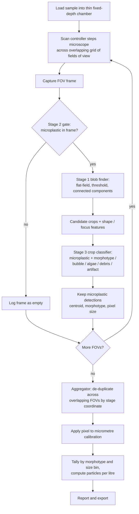
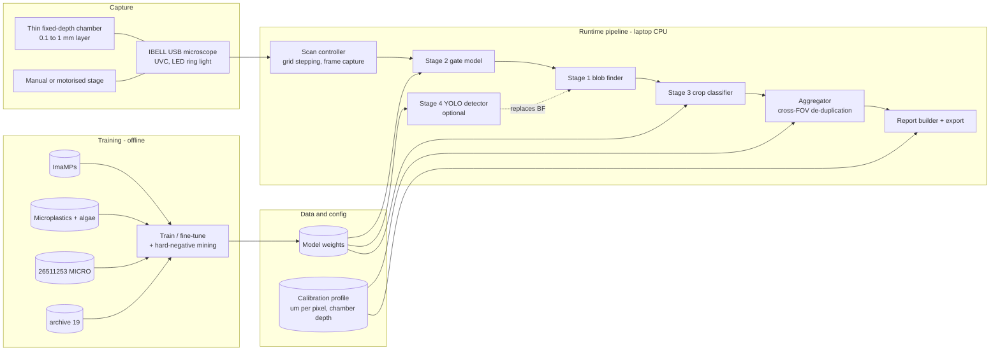
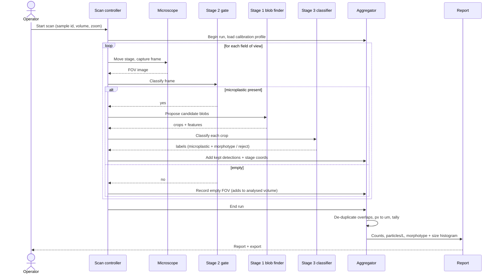

# Low-Cost Microplastic Counter — Product Requirements

| | |
|---|
> [!NOTE]
> **Architecture & Roadmap Evolution**:
> - **Sample Modality**: Updated from a wet slide chamber to **gridded membrane filter paper** (0.45 µm / 1.2 µm), providing a true 2D focal plane, standard 3.10 mm grid lines for optical auto-calibration, and direct volume concentration math ( = N / V_{\\text{filtered}}$).
> - **Model**: Updated from the 4-stage cascade to single-pass **YOLOv8-Seg Instance Segmentation**.
> - **Phasing**: The core Vision AI, sizing, and dashboard constitute **Phase 1**. pH/TDS IoT hardware is deferred to **Phase 2**.
> - See [revised-microplastic-detector-plan.md](revised-microplastic-detector-plan.md) and [ML_DATASET_PLAN.md](ML_DATASET_PLAN.md) for current specs.

---|
| **Owner** | project: water-microplasts |
| **Version** | 0.1 |
| **Date** | 2026-09-06 |
| **Status** | Draft for review |

A benchtop tool that counts and sizes suspected microplastic particles in a water
sample using an IBELL USB microscope, a thin water chamber, and two small vision
models.

---

## 1. Summary & problem

Microplastic screening today needs either a lab microscope and a trained analyst,
or spectroscopy hardware that costs more than the rest of the setup combined.
Neither fits fieldwork, classrooms, or citizen-science budgets.

This product does one job well: given a water sample, report roughly **how many
microplastic particles it contains, their shapes, and their sizes**, from images
alone. The capture device is a consumer **IBELL USB microscope**. The sample is
held in a thin, fixed-depth chamber so the full water layer stays in focus and the
imaged volume is known. Software scans the chamber field by field, flags fields
that contain particles, then finds, classifies, and counts each particle.

It is a screening and monitoring instrument, not an analytical one. It answers
"is this water contaminated, and by how much, trending which way" — not "which
polymer is this."

---

## 2. Goals & non-goals

### Goals

- Count suspected microplastic particles in a prepared water sample and express
  the result as **particles per litre**.
- Classify each particle by **morphotype** — fragment, fibre, film, foam, pellet.
- Estimate each particle's **size** in micrometres, after a one-time calibration
  per zoom level.
- Run the full analysis on a **laptop-class CPU**, no dedicated GPU required.
- Ship a usable **presence / coarse-level** result early, before per-particle
  counting is finished.
- Reject the common look-alikes: **air bubbles, algae and organic debris, glass
  scratches, and out-of-focus halos.**

### Non-goals

- **Polymer identification** (PE / PP / PET / PS). This is a chemical property
  that requires FTIR or Raman spectroscopy — hardware the product deliberately
  excludes. Out of scope, permanently.
- Imaging open / bulk water directly (see §4).
- Detecting particles below the optical resolution floor of the IBELL at the
  chosen zoom (see §8).
- Regulatory-grade quantification. Results are comparative and trend-oriented.

---

## 3. Users & context

| Segment | Description |
|---|---|
| **Primary** | Environmental students, educators, and citizen-science groups sampling ponds, tap water, and packaged water. Want a defensible particle count and trend over time, on a small budget. |
| **Secondary** | Small labs and NGOs doing pre-screening before sending a subset of samples for proper spectroscopic analysis elsewhere. |

Typical session: prepare a sample, load the thin chamber, start a scan, wait a few
minutes, read a report. The operator is assumed to be careful but not a microscopy
specialist.

---

## 4. Hardware & sample setup

Capture device is fixed: **IBELL USB microscope** (UVC webcam interface, built-in
LED ring light, manual focus, low-cost CMOS sensor). Everything below is designed
around its limits — soft optics, vignetting, an LED hotspot, chromatic fringing,
and a very shallow depth of field.

> **Constraint that drives the design.** At useful magnification the lens holds
> only a paper-thin layer in focus. In an open cup, particles sit at every depth —
> most are blurred or invisible — and they drift between frames. **The product
> does not image open water.**

### Thin fixed-depth chamber (required)

The sample is confined to a **0.1–1 mm** layer so the whole depth is in focus,
particles are near-stationary, and the imaged volume per frame is known. Candidate
chambers, cheapest first:

- **Well slide + coverslip** — near-zero cost, depth roughly known.
- **Two slides + laser-cut spacer / tape shim** — depth set by the shim,
  repeatable.
- **Sedgewick-Rafter counting cell** — ~1 mm, precisely defined volume, ~US$100.
  Reference option.

Sample prep (filtering or settling to concentrate particles into a smaller volume
before viewing) is expected but not yet specified — see §12.

### Optional: Nile Red staining

Nile Red dye + a blue excitation LED + an orange emission filter (all low-cost,
still just the USB microscope). Plastics fluoresce bright coral; most mineral and
organic matter does not; algae autofluoresces a different colour. This removes
most of the hardest confuser class. Treated as an optional add to trial once
hardware is in hand, not a v1 requirement.

---

## 5. How it works — runtime flow

The operator (or a simple motorised stage) steps the microscope across the chamber
in an overlapping grid of **fields of view** (FOV). For each FOV frame:

1. **Gate.** A whole-frame classifier asks "any microplastic here?" Empty frames
   are logged and skipped — this saves time and stops empty frames generating
   false positives.
2. **Detect & classify.** On frames that pass, a blob finder proposes candidate
   particles; a small classifier labels each candidate (microplastic + morphotype,
   or bubble / algae / debris / artifact).
3. **Aggregate.** Particles are de-duplicated across overlapping FOVs by stage
   coordinate, converted from pixels to micrometres, and tallied by morphotype and
   size bin.
4. **Report.** Total count, particles per litre, morphotype breakdown, size
   histogram, and the analysed volume.

The classical blob finder also runs stand-alone as a no-model fallback and as a
bootstrapping tool for labelling.

### Processing flowchart



---

## 6. Model architecture

Four build stages. **Two are ML models**; Stage 1 is plain image processing;
Stage 4 is an additional ML model built only if Stage 1's blob finder proves too
weak.

| Stage | Name | ML? | Ships in v1 |
|---|---|---|---|
| 1 | Blob finder | No — classical CV | Yes |
| 2 | FOV gate | Yes — model #1 | Yes |
| 3 | Crop classifier | Yes — model #2 | Yes |
| 4 | YOLO detector | Yes — model #3 | Only if needed |

> Build order is 1 → 2 → 3 → 4. **Runtime order differs:** the Stage 2 gate runs
> first, then Stage 1 proposals feed Stage 3.

### Stage 1 — Blob finder (no ML)

Flat-field correction to remove the LED hotspot and vignette; adaptive threshold
plus an edge path for translucent films; connected components. Per blob: area,
circularity, aspect ratio, solidity, mean colour, and **edge sharpness** — the key
feature for discarding particles in the wrong focal plane. Tuned for high recall;
precision is Stage 3's job. Runs anywhere, fully explainable, and generates weak
labels to bootstrap the ML stages.

### Stage 2 — FOV gate (ML model #1)

Small pretrained backbone (MobileNetV3 / EfficientNet-Lite class), single yes/no
output, input downscaled with aspect ratio preserved. Trained on **ImaMPs**
(already labelled present / absent — zero annotation cost). Operating point set for
high recall. Photometric augmentation (blur, noise, JPEG artifacts, colour
fringing, glare) simulates IBELL output. Shippable on its own as a "contamination
present / coarse level" tool.

### Stage 3 — Crop classifier (ML model #2)

Takes each Stage 1 candidate crop and labels it: microplastic with morphotype, or
membrane / debris, algae, bubble, artifact. Optionally fed the Stage 1 geometric
features alongside the pixels. Trained from the *Microplastic images + algae* set,
the *MICRO* crops, and crops mined from ImaMPs (clean-frame blobs = negatives;
hand-clicked positives in positive frames). **Hard-negative mining** — feeding its
own false positives back as negatives and retraining — is the main accuracy lever.

### Stage 4 — YOLO detector (optional ML model #3)

Added only if Stage 1 keeps missing particles (faint films, clumped or touching
particles) or tighter boxes are needed for sizing. One-step box detector,
pretrained on *archive (19)* + *MICRO* boxes, fine-tuned on hand-labelled IBELL
frames (SAM-assisted pre-labels to cut labelling cost). Replaces the Stage 1
proposal step; the gate and aggregation layer are unchanged.

### High-level system design



### Runtime sequence



---

## 7. Data assets

Four public datasets, pruned to what a USB microscope viewing a thin water layer
will actually see. Whole-object and meso-scale debris was removed on 2026-09-06.

### Kept — 7,267 images

| Dataset | Images | Content | Role |
|---|---:|---|---|
| 26511253 · MICRO (+ VALIDATION/MICRO) | 5,346 | Small crops of single microplastic bits: hard fragment, line/fibre, foam, pellet; a *noise* folder of background-only shots. Box coords in `annotation/*.tsv`. | Stage 3 morphotype examples; Stage 4 box pre-training; negatives. |
| Microplastic images + algae (deep learning) | 1,140 | Single particles by type (fragment / filament / pellet) plus an *algae* class, microscope, light background. | Stage 3 backbone — particle-type + the key algae confuser. |
| archive (19) | 781 | Particles in a round dish, dark background, bounding boxes, single "Microplastic" class. | Stage 4 detector pre-training; closest look to a dish of water. |
| ImaMPs (Zenodo 18027599) — *to download* | 6,000 | Stereo-microscope photos on filter membrane, split *CLASE_0* (clean) / *CLASE_1* (has microplastic). ~30 GB TIFF. | Stage 2 gate training (only present/absent-labelled set); hard-negative source. |

### Removed — 2,403 images, 268 MB

| Path | Images | Why |
|---|---:|---|
| 26511253 / MACRO | 803 | Whole bottles, caps, cutlery, straws, toothbrushes, masks — never seen through this camera. |
| 26511253 / MESO | 1,524 | 5–25 mm fragments, caps, cigarette butts, wrappers, spacers — out of scale. |
| 26511253 / VALIDATION / MACRO + MESO | 76 | Same, validation split. |

**Not used:** `ph-tds-waer-micrplsts` — pH / TDS number tables, no imagery. Left in
place; only relevant if we later correlate water chemistry with counts.

> **Data rule.** Every kept dataset is sharper and cleaner than IBELL output.
> During training, **degrade the training images to match the camera** — downscale,
> blur, sensor noise, JPEG artifacts, chromatic aberration, vignette, a glare spot
> — or the models learn "clean image = plastic" and fail in the field.

---

## 8. Calibration & output

### Pixel → micrometre (once per zoom level)

Photograph a stage micrometer at each zoom used; measure a known length in pixels.

```
um_per_px       = micrometer_length_um / length_px
min_particle_um ≈ 2 to 3 px  ×  um_per_px      # smallest reliably detectable
```

### Count → concentration

Because the chamber depth is fixed and known, each frame images a known volume.

```
V_analysed_L  = sum( FOV_area_mm2 × chamber_depth_mm ) / 1000
concentration = N_particles / V_analysed_L              # particles per litre
```

### Report contents

- Total suspected microplastic count and particles·L⁻¹
- Morphotype breakdown (fragment / fibre / film / foam / pellet)
- Size histogram in µm, with the detection floor marked
- Analysed volume, FOV count, zoom level, stain on/off
- Rejected-object tallies (bubbles, algae, debris) for QA

---

## 9. Milestones

### Phase 0 — now, no camera required

1. Download ImaMPs.
2. Build Stage 1. Run on ImaMPs. Hand-mark particles on 50–100 ImaMPs positive
   frames as a temporary answer key.
3. Train Stage 2 on ImaMPs, split by collection site. **Deliverable: working
   yes/no gate.**
4. Train Stage 3 from algae + MICRO + ImaMPs crops. Wire Stage 1 → Stage 3. Add
   cross-FOV de-duplication. **Deliverable: end-to-end counter, measured on
   ImaMPs.**

### Phase 1 — on IBELL arrival

5. Build the thin chamber. Capture 200–500 frames: blank water, water spiked with
   known plastic bits, real samples; in and slightly out of focus; both zoom
   levels.
6. Re-evaluate every stage on IBELL frames. Fine-tune whichever regressed.
7. Stage-micrometer and analysed-volume calibration.
8. If Stage 1 recall is the bottleneck, label a few hundred frames (SAM-assisted)
   and train Stage 4. Otherwise stop.

---

## 10. Success metrics

| Metric | Target (v1) | Measured on |
|---|---|---|
| Stage 1 blob recall | ≥ 0.90 | Hand-marked frame set |
| Stage 2 gate recall (positive frames) | ≥ 0.97 | Held-out IBELL frames |
| Stage 3 per-particle F1 | ≥ 0.80 | Held-out IBELL frames |
| Particle count error per chamber | ≤ ±15% | Spiked samples, known count |
| False positives from bubbles + algae | ≤ 1 per 10 FOV | Blank stained + unstained water |
| Full chamber scan time | < 5 min | Target laptop CPU |
| Size accuracy vs manual measure | ± 20% | Calibration target + manual |

---

## 11. Risks & mitigations

| Risk | Severity | Mitigation |
|---|---|---|
| Shallow depth of field makes open-water imaging unusable | High | Mandatory thin fixed-depth chamber; open-water mode explicitly out of scope |
| Domain gap: public datasets vs IBELL optics & lighting | High | Degrade-to-match augmentation; 200–500 own-camera frames for fine-tune + validation |
| Air bubbles and algae read as particles | Medium | Dedicated reject classes in Stage 3; hard-negative mining; optional Nile Red stain |
| IBELL resolution limits smallest detectable particle | Medium | Publish the µm detection floor per zoom; report never implies sub-floor sensitivity |
| Particle drift causes double counting across FOVs | Medium | Sealed thin chamber; overlap-aware de-duplication by stage coordinate |
| ImaMPs is one region, one rig, two resolutions — biased | Medium | Use for pre-training and the gate only; all headline metrics measured on own data |
| Users read counts as polymer-confirmed microplastics | Medium | Report wording: "suspected"; non-goal stated on every export |
| Stage 4 labelling capacity | Low | Only triggered if needed; SAM-assisted pre-labels; reuse Stage 3 detections as drafts |

---

## 12. Open questions

- **Chamber choice** — well slide, slide + shim, or Sedgewick-Rafter cell for v1?
  Sets how precise the volume figure is.
- **Deployment host** — laptop, Raspberry Pi, or phone? Changes the Stage 2/3
  model size budget and whether Stage 4 is viable.
- **Smallest target particle size** in µm — drives zoom level, FOV count, and scan
  time.
- **Morphotype breakdown in v1**, or total count only with shapes deferred?
- **Nile Red** in v1 or Phase 2? Affects the confuser budget and the capture
  protocol.
- **Sample prep** — how is pond/tap water filtered or settled and concentrated
  before it reaches the chamber?
- **Analysed-volume tracking** — manual FOV count, or a stage encoder?
