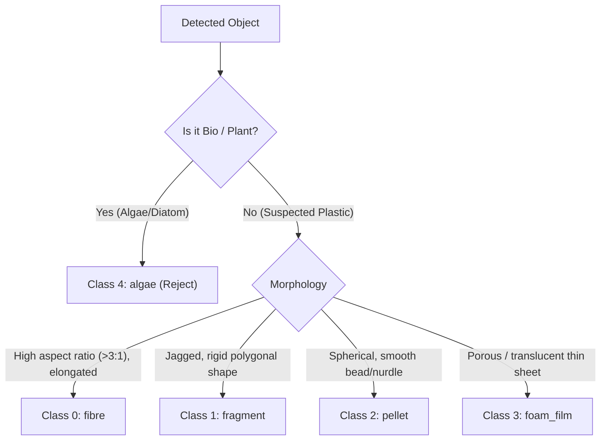

# ML Vision Pipeline & Dataset Specification

A detailed technical design document for the **Instance Segmentation (YOLOv8-Seg / YOLO11-Seg)**, **Gridded Filter Paper Auto-Masking & Degradation Synthesis**, **Particle Sizing Engine**, and **Optical Resolution Floor Guard**.

> [!NOTE]
> **Phase 1 Priority**: The ML Vision pipeline and Filter Paper Counter constitute Phase 1. Physical pH & TDS sensor integration is deferred to Phase 2.

---

## 1. Requirements Summary & Target Specifications

| Specification | Implementation Strategy |
|---|---|
| **Task Type** | Instance Segmentation | YOLOv8-seg / YOLO11-seg (predicts bounding box + polygon mask) |
| **Classes (5)** | `0: fibre`, `1: fragment`, `2: pellet`, `3: foam_film`, `4: algae` | Algae acts as an organic non-plastic reject class |
| **Modality** | Gridded Membrane Filter Paper | Eliminates liquid drift; standard 3.10 mm grid lines act as scale target |
| **Sizing Metrics** | Length ($\mu m$), Width ($\mu m$), Area ($\mu m^2$), Aspect Ratio | Extracted directly from polygon mask and minimum area bounding box |
| **Artifact Rejection** | Dual-Gate: Sharpness + Confidence | Laplacian edge gradient filter + UI confidence slider |
| **Optical Floor** | Auto-resolution guard | Flags particles < 3 pixels (< $3 \times \mu m/\text{px}$) as borderline resolution |
| **Inference Latency** | < 1.0 sec (sub-second target) | ~15–30 ms on RTX 4060 GPU / ~70–120 ms on CPU |
| **Hardware** | Local Laptop (Intel UHD + NVIDIA RTX 4060) | GPU accelerated (PyTorch CUDA) with CPU fallback |

---

## 2. 5-Class Target Taxonomy

---

## 3. Dataset Preprocessing & Filter Paper Scene Compositor

### 3.1 Raw Datasets
- **`26511253/MICRO/MICRO/`**: Single particle crops for fibres, fragments, pellets, foam.
- **`Microplastics and algae/`**: Filaments, fragments, pellets, and 300 real algae images (`algae I`).
- **`CLASE_0.zip` (Zenodo ImaMPs)**: 3,000 clean and silt-covered gridded filter papers (backgrounds).
- **`CLASE_1.zip` (Zenodo ImaMPs)**: 3,000 real contaminated filter papers (ground truth validation).

### 3.2 Automated Polygon Mask Generation
Extract ground-truth segmentation masks from single-particle crops using adaptive thresholding and contour extraction (`cv2.findContours`). Convert contour vertices to normalized YOLO segmentation format:
`class_id x1 y1 x2 y2 x3 y3 ...`

### 3.3 Synthetic Scene Compositing
Composite 1–15 random segmented particles onto gridded filter paper backgrounds with random rotation (0°–360°), scale variation (0.2x–1.8x), and slight translucency.

---

## 4. Optical Domain Adaptation (IBELL Simulation)
1. **LED Ring Hotspot & Radial Vignette**: Multiplies brightness by a 2D Gaussian mask with falloff towards the edges.
2. **Chromatic Aberration**: Shifts Red and Blue channels radially by 1–3 pixels relative to Green.
3. **Defocus Blur**: Applies mild Gaussian blur ($\sigma \in [0.8, 1.8]$) mimicking shallow depth-of-field.
4. **Sensor Noise**: Adds low-light Poisson-Gaussian noise and JPEG compression artifacts.

*We mix 50% pristine + 50% optically degraded images into the final YOLO training split.*

---

## 5. Morphological Sizing Engine & Optical Floor Guard
- **Minimum Area Bounding Box**: `rect = cv2.minAreaRect(contour)` -> (center, (w_px, h_px), angle).
- **Physical Scale**: $\text{Length}_{\mu m} = \max(w, h) \times S$, $\text{Width}_{\mu m} = \min(w, h) \times S$.
- **Sharpness Gate**: Reject crops where $\text{Var}(\text{Laplacian}(\text{crop})) < \text{Threshold}$.
- **Optical Floor Guard**: Warn if $\text{Length}_{\mu m} < 3 \times S$.
