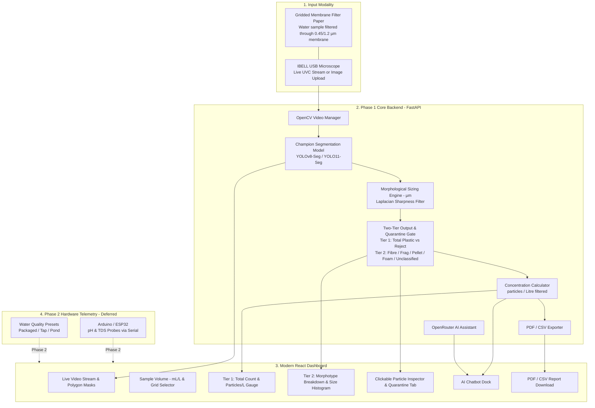

# Microplastic Detector & Water Intelligence System — Revised Plan

A comprehensive, lab-standard screening tool combining an **IBELL USB microscope**, **gridded membrane filter papers**, an **Instance Segmentation AI model (YOLOv8-Seg / YOLO11-Seg)**, an **interactive web dashboard**, and an **intelligent AI assistant** powered by OpenRouter.

> [!NOTE]
> **Phase Demarcation**:
> - **Phase 1 (Current Focus)**: Core Vision AI, multi-model evaluation (YOLOv8 vs YOLO11), gridded filter paper detection, particle sizing ($\mu m$), laboratory concentration calculation ($\text{particles/L}$), interactive React dashboard, particle inspector, and PDF/CSV reporting.
> - **Phase 2 (Deferred Hardware Integration)**: Arduino/ESP32 hardware probes, live pH & TDS sensor telemetry, and chemical water quality gauges.

---

## 1. High-Level Summary

1. **Two-Tier Detection Hierarchy (General vs Specific)**
   - **Tier 1 — Overall Contamination ("Microplastic or Not")**: The model aggregates all plastic detections (`fibre`, `fragment`, `pellet`, `foam/film`) into a **Total Microplastics Count** and converts it into **Particles per Litre** ($C = N / V_{\text{filtered}}$). Algae, sediment, paper fibers, and grid lines are excluded.
   - **Tier 2 — Granular Morphotype Breakdown**: For every confirmed plastic particle, it classifies the specific sub-type, its exact dimensions (length and width in $\mu m$), aspect ratio, and surface area.

2. **Handling Non-Target / Unknown Particles & Confusers**
   - **Mineral Silt & Sand**: The `CLASE_0` dataset contains thousands of silt-laden filter papers. The model is trained to treat mineral grains and clay stains as non-plastic background.
   - **Microscopic Algae**: Filtered water carries diatoms and cellular algae. Dedicated Class 4 (`algae`) filters these out.
   - **Natural Fibres (Cotton, Wool, Linen)**: Under standard optical light, natural and synthetic fibres share thread geometry. Per ASTM/NOAA optical standards, they are reported as *"Suspected Microplastic Fibres"*.
   - **Out-of-Distribution Debris (Quarantine Gate)**: SPECKs with confidence below threshold (< 45%) or anomalous profiles are routed to an **"Unclassified Debris"** review bucket to prevent false-positive contamination counts.

3. **Multi-Model Benchmarking Strategy**
   - We evaluate 3 candidate segmentation architectures (`yolov8n-seg`, `yolo11n-seg`, and `yolo11s-seg`) against a classical CV baseline.
   - Specifically compares **thin fibre recall** (resolving threads only 2–4 px wide) against inference latency on the local RTX 4060 GPU and CPU fallback, selecting the champion model for deployment.

4. **The Control Panel (FastAPI + React Dashboard)**
   - High-speed web interface with live microscope streaming and image upload options.
   - Toggleable polygon segmentation masks, bounding boxes, and confidence labels.
   - Morphotype breakdown distribution charts, particle size histograms ($\mu m$), and clickable particle inspector.
   - PDF & CSV export for laboratory reporting and audit trails.

5. **The Expert Assistant (OpenRouter AI Chatbot)**
   - Powered by OpenRouter free-tier LLMs (e.g. Gemini 2.0 Flash, LLaMA 3.3 70B).
   - Context-aware: automatically receives particle counts, morphotypes, and filtered sample volume.
   - Answers water safety questions, identifies likely plastic sources (synthetic textiles, bottle shards, degraded packaging), and suggests filtration strategies.

6. **Hardware Health Check (pH & TDS Probes) — [Phase 2 Deferred]**
   - Connects an Arduino / ESP32 with analog pH and TDS probes over USB serial to correlate chemical water quality with physical plastic particulate counts.

---

## 2. System Architecture

---

## 3. Dataset Assets & Exact Roles

| Dataset | Sample Count | Format / Details | Role in Filter Paper System |
|---|---|---|---|
| **CLASE_0 (Zenodo ImaMPs)** | 3,000 frames (14.4 GB) | Clean and silt-covered gridded filter papers | **Background Canvas**: Teaches model to ignore printed grid lines, paper grain, and silt |
| **CLASE_1 (Zenodo ImaMPs)** | 3,000 frames (15.1 GB) | Real filter papers with captured microplastics | **Real-World Benchmark**: Held-out test set and hard-negative mining |
| **26511253 (MICRO)** | 5,346 crops | Lines/fibres, rigid fragments, pellets, foam | **Object Foreground**: Polygon masks extracted and placed onto filter paper backgrounds |
| **Microplastics & Algae** | 1,142 images | Filaments, fragments, pellets, and 300 real algae images | **Biological Confuser**: Trains reject class to stop algae triggering false plastic counts |
| **archive (19)** | 781 images | Liquid dish scenes with bounding boxes | **Pre-training**: Generalization and boundary detection |
| **ph-tds-waer-micrplsts** | Tabular data | pH and TDS measurements (Packaged, Tap, Pond) | **Phase 2 Telemetry**: Baseline distributions for future sensor calibration |

---

## 4. Phase 1 Technology Stack & Multi-Model Candidates

- **Segmentation Models Tested**:
  - `yolov8n-seg` (Ultralytics Nano baseline, ~3.2M params)
  - `yolo11n-seg` (Ultralytics 2024 Nano, ~2.9M params, C3k2 blocks)
  - `yolo11s-seg` / `yolov8s-seg` (Small capacity, ~9.4M-11.8M params, high-res fibre feature maps)
  - Classical CV baseline (Otsu adaptive thresholding control)
- **Frameworks**: PyTorch (CUDA on NVIDIA RTX 4060 GPU), Ultralytics, OpenCV (`cv2`), NumPy, PIL.
- **Backend**: Python 3.10+, FastAPI, Uvicorn, ReportLab (PDF), Pandas (CSV).
- **Frontend**: React 18, Vite, Tailwind CSS, Lucide React Icons, Recharts, Axios.
- **AI Diagnostics**: OpenRouter API (`google/gemini-2.0-flash-exp:free`, `meta-llama/llama-3.3-70b-instruct:free`).

---

## 5. Execution Roadmap

### Phase 1 — Core Vision & Filter Paper Dashboard (Active)
- [ ] **Step 1: Dataset Prep & Scene Compositor**
  - Extract polygon masks from `26511253` crops and `Microplastics and algae`.
  - Composite particles onto `CLASE_0` gridded filter paper backgrounds.
  - Apply 50% synthetic IBELL optical degradation (vignette, LED hotspot, chromatic fringing, defocus blur, noise).
- [ ] **Step 2: Multi-Model Training & Benchmarking**
  - Train `yolov8n-seg`, `yolo11n-seg`, and `yolo11s-seg` on RTX 4060 GPU.
  - Run comparative benchmark: Mask mAP50-95, thin fibre recall, inference latency.
  - Select champion model for FastAPI deployment.
- [ ] **Step 3: Sizing, Two-Tier Engine & Quarantine Gate**
  - Minimum area bounding box for length and width in $\mu m$.
  - Laplacian variance sharpness filter to discard out-of-focus particles.
  - Two-tier output logic: Tier 1 (Total Plastics / L) and Tier 2 (Morphotypes).
  - Confidence gate (< 45% -> "Unclassified Debris").
- [ ] **Step 4: FastAPI Backend**
  - Camera streaming and image upload inference endpoints.
  - OpenRouter AI diagnostic endpoint.
  - PDF & CSV report generation.
- [ ] **Step 5: Modern React Dashboard**
  - Live video stream with polygon mask overlays.
  - Interactive particle inspector gallery with "Unclassified Debris" review tab.
  - Concentration gauge and morphology charts.
  - AI chat assistant and export buttons.
- [ ] **Step 6: End-to-End Verification**
  - Test on sample frames from `report_images/` and `CLASE_1`.

---

### Phase 2 — IoT Sensor Subsystem (Deferred)
- [ ] Connect Arduino/ESP32 analog pH and TDS probes.
- [ ] Implement USB serial listener at 115200 baud.
- [ ] Integrate WHO/BIS color-coded safety telemetry cards into the dashboard.
- [ ] Flash Arduino sketch (`scripts/arduino_water_sensors.ino`).
